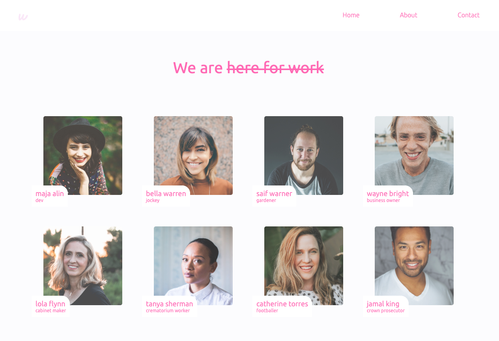

# "About us" page



An "About us" page build with headless CMS Sanity

## Installation
- Clone the repository
```
$ git clone https://github.com/majaalin/about-us-page
```
- In the project directory, run: 
- Start a local server
```
$ npm start
```
- This runs the app in the development mode. Open http://localhost:3000 to view it in the browser.

## License
This project is licensed under the MIT License.